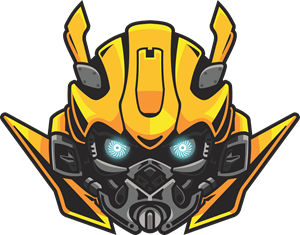

Hi My name is Amirhossein
===================================================================================================================================

Web developer and Graphic designer
----------------------------------

I'm a passionate computer science student at the University of Guillan, with a strong focus on full-stack web development. My expertise lies on building robust and scalable applications using Django for the backend and React.js for the frontend.

<h2 align="center">🔥 Languages & Frameworks & Tools & Abilities 🔥</h2>
 

  <code></code>
  <code></code>
  <code></code>
  <code></code>
  <code></code>
  <code></code>
  <code></code>
  <code></code>
  <code></code>
  <code></code>
  <code></code>
  <code></code>
  <code></code>
  <code></code>
  <code></code>
  <code></code>
  <code></code>
  <code></code>
  <code></code>

<h4 align="center">
  <a href="https://github.com/capamir?tab=repositories" title="My Repositories">🔎 My Repositories 🔍</a>
</h4>

#### 🚀 Currently Exploring:
I'm on a journey to enhance my skills and broaden my horizons. Currently, I'm diving into the world of mobile development with React Native. Excited about the possibilities and challenges that come with building cross-platform mobile applications.

#### 🌱 Learning Goals:
- Mastering React Native for mobile development
- Continuous improvement in web development practices
- Exploring new technologies and frameworks

*   🌍  I'm based in Rasht, IR
*   ✉️  You can contact me at [amirhn.workmail@gmail.com](mailto:amirhn.workmail@gmail.com)
*   ⚡  I'm secretly Batman so don't call me at night cause I'm saving the Gotham

#### 📫 Let's Connect:
Feel free to reach out if you share similar interests, have exciting project ideas, or just want to connect. I'm always open to collaboration and learning from fellow developers!

Happy coding! 🚀

